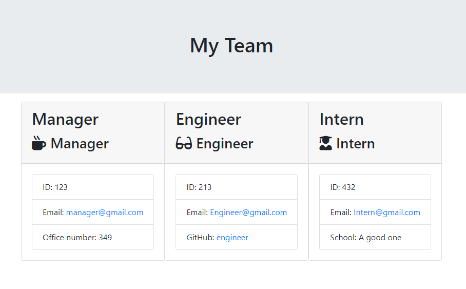
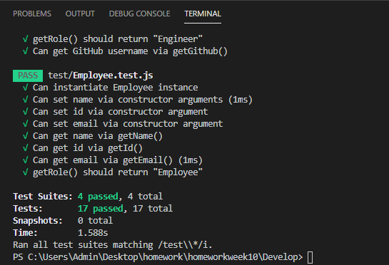

## Description ##
This application runs through the terminal of Visual Studio code then prompts users to input data abou there workplace team. After all of the data is gathered the user will then select "Create HTML" on the command line. Then a HTML page will be created using all of the data gathered from user inputs.

## Intructions ##
Open the app.js file in Visual studio code then open the terminal to the Develop Directory then run a "npm install" in the terminal, this will install all of the required components for the app. After simply run a "node app.js" in the terminal to start the application. After all of the roles are filled out the user then selects "Create HTML" then view the new HTML in the output folder in the repo.        

## Testing ##
Simply run "npm test" within the terminal to starts the jest testing.
